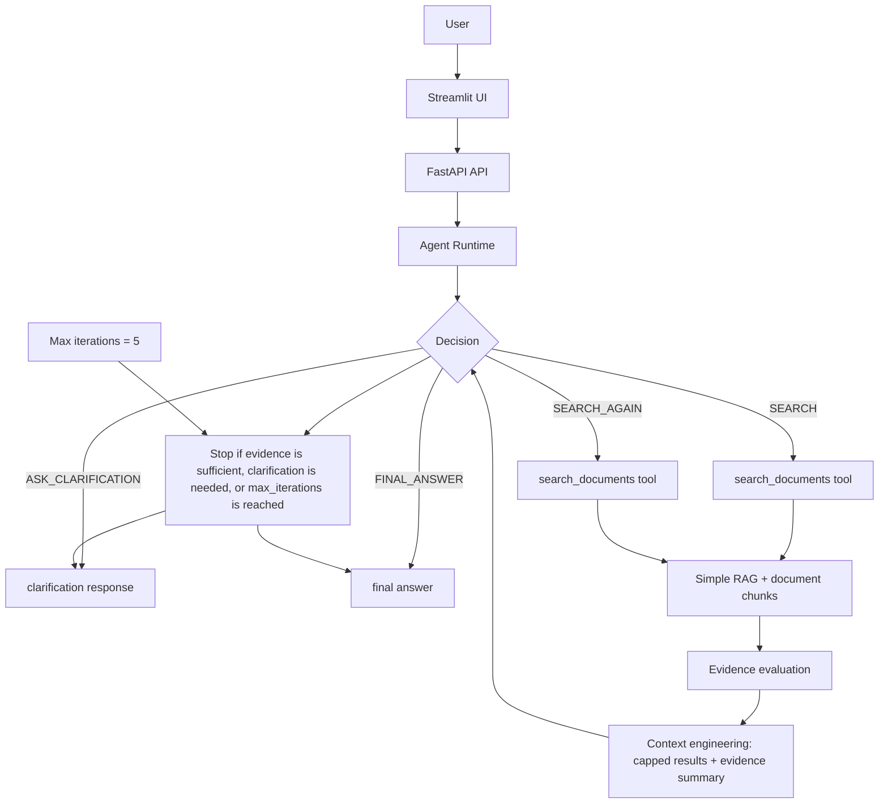

# W16 Architecture Diagram

The W16 runtime keeps the W15 retrieval and API pattern but adds a genuine loop in which the previous search results influence the next decision. Evidence is compacted before synthesis, failures are handled explicitly, and the system stops at a hard limit when the question cannot be answered safely.
